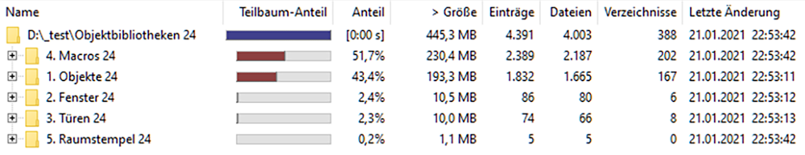
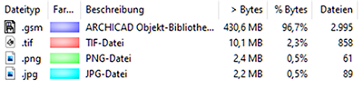
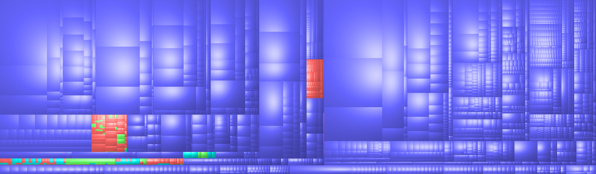

# Statistiken für Archicads <abbr title="Out of the Box; also 'mitgeliefert'">OOTB</abbr> Objekt-Bibliothek

Die von Graphisoft mitgelieferte Objektbibliothek erscheint selbst dem geneigten Anwender manchmal wie eine Black Box, in die man nicht hineinschauen kann. 
Inspiriert durch die ursprüngliche Frage nach den in der Standard-Objektbibliothek von Archicad verwendeten Stiften im Folgenden eine kleine Übersicht:

1. Zunächst mal schauen wir, wo die Standardbibliothek abgelegt ist. Diese ist dabei in einen Library Container zusammengepackt – ähnlich wie ein Zip-File.  
Der Standardort in der deutschen Version ist `C:\Program Files\GRAPHISOFT\ARCHICAD 24\BIBLIOTHEKEN 24`. Darin liegt `Objektbibliotheken 24.lcf`. LCF ist das `Library Container Format`.
2. Mit dem `LP_XMLConverter` können wir in einem ersten Schritt die LCf entpacken. Das Ergebnis wird eine Verzeichnisstruktur mit einzelnen `.gsm` Dateien sein, die der Ansicht innerhalb Archicads Objektwerkzeug entspricht. (Die Ausnahme ist jedoch, dass nicht alle Objekte platzierbar sind, sondern lediglich sogenannte Makros, oder weil es Türen/Fenster sind, die mit dem entsprechendem eigenen Werkzeug platziert werden).  
Der Befehl für die Kommandozeile lautet
```bash
$ LP_XMLConverter extractcontainer <lcf> <libraryFolder>
```
... wobei `<lcf>` den Dateiort des Bibliothekscontainers angibt, und `<libraryFolder>` das Zielverzeichnis, in welches extrahiert werden soll.  
Erstaunlicherweise geht das recht flott vonstatten – trotz der **Größe des LCFs von 446 mb**.

3. Gegen die nun in Einzelobjekte zerlegte Bilbiothek lassen sich schon mal die ersten Statistiken fahren. Dafür analysiere ich die Ordner-/Dateistruktur mittels [WinDirStat](https://sourceforge.net/projects/windirstat/):







Im Gegensatz zu Revit Familien basieren GDL Objekte rein auf Code und komprimieren dadurch recht gut.

Beschreibung | • | Bash Befehl (Mit WSL erstellt)
--- | --- | ---
[Liste mit allen Dateien](ac24/ac24_total_list.txt), aufgeschlüsselt nach Ordnern | – | `ls -R > ../ac24/ac24_total_list.txt`
Anzahl an `.gsm` Dateien | 2995 | `ls -R \| grep '.gsm' \| wc -l`
Davon Makros | 1179 = 39% | –
Anzahl an Bildern | 1008 | `ls -R \| grep '.jpg\\|.png\\|.tif' \| wc -l`
[Liste mit den 20 größten Dateien](ac24/ac24_biggest_files.txt) | – | `find . -type f -exec du -a {} + \| sort -rn \| head -n 20 > ../ac24/ac24_biggest_files.txt`

4. Zuletzt konvertieren wir die `.gsm` Objekte noch ins [Hierarchical Source Format (HSF)](https://gdl.graphisoft.com/tips-and-tricks/hsf-source-format). Das funktioniert mit dem Befehl:

```bash
$ LP_XMLConverter l2hsf <source> <dest>
```

Das dauert mit 10 Minuten diesmal etwas länger.  
Dafür haben wir nun alle Archicad-Objekte und Makros im Plain-Text vor uns liegen. (Und jetzt erklären sich auch die großen Dateien: In jenen Objekten sind schlichtweg Bilder eingebettet, die das `.gsm` aufblähen.)

Damit kann der Spaß beginnen:

Beschreibung | • | Erläuterung
--- | --- | ---
Haben alle Objekte Graphisoft als Autor? | Ja | `find . -name "libpartdocs.xml" -exec grep -i -E "<author>^(Graphisoft)" {} +`
Sind alle Objekte unter CC BY lizensiert? | Ja | `find . -name "libpartdocs.xml" -exec grep -i -E "<type>^(CC BY)" {} +`
[Die 10 längsten (LoC) GDL-Skripte](ac24/ac24_longest_scripts_1_objekte.txt) | – | `find . -name "*.gdl" -type f -print0 \| xargs -0 wc -l \| sort -rn \| grep -v ' total$' \|  head -n 10 > ../../ac24/ac24_longest_scripts_1_objekte.txt`
Gesamtzahl Codelines | 3'479'962 | `find . -name "*.gdl" -type f -print0 \| xargs -0 wc -l \| sort -rn  \| awk '/total/{k+=$1}END{print k}';`
[Alle 'geCALLten' Makros](ac24/ac24_all_macro_calls.txt) | – | Siehe [getMacros.py](getMacros.py)
Alle Parameter nach Häufigkeit, Typ, und Objektart sortiert | – | Siehe alle `.txt` Dateien beginnend mit `ac24/ac24_pars_…` // [getParameterNames.py](getParameterNames.py)
[Alle verwendeten Stiftfarben](ac24/ac24_pencolors_1_objekte.txt) | - | Siehe [getPencolors.py](getPenColors.py)
Meiste Parameter <br> [Vollständige Liste](ac24/ac24_parscount.csv) | 993 | `5-Flügelfenster 24`. Nur knapp an den maximal 1024 in GDL erlaubten Parametern vorbeigeschrammt. <br> Siehe [getParameterCount.py](getParameterCount.py)

---

<small>_Tautological boilerplate: All trademarks and copyrights on this page are the property of their respective owners._</small>
